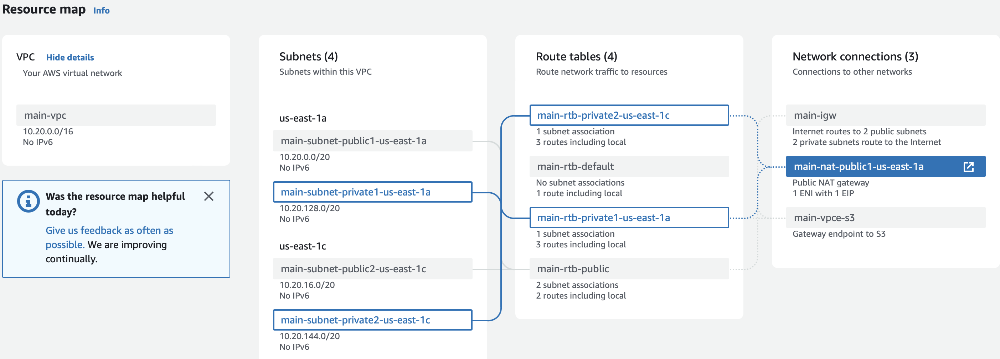
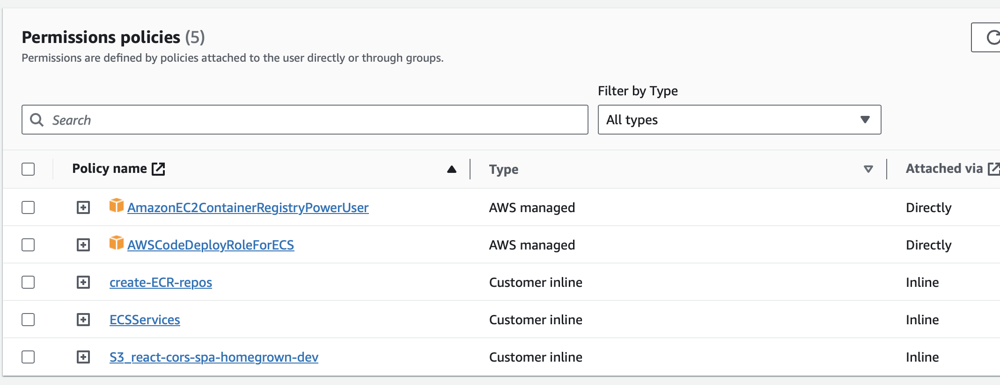

# Scary Fast Apps (SFA) from Neighborhood Studios

<a href="https://twitter.com/intent/follow?screen_name=GoodStuffNearby"></a>
<a href="https://writing.neighborhoodstudios.com"></a>

## Introduction

---

We're a venture studio that partners with tenacious founders to build hyper-local startups from the ground up.

Every studio is a little different. Our model is to come up with a new idea every month, build an MVP and let users
decide if they love that idea or not.

We build [A LOT OF NEW THINGS](https://writing.neighborhoodstudios.com). Every time we come up with the next best idea,
we're going through a lot of the same motions to get it off the ground.

So we decided to build an opinionated framework to help us build new things faster. Introducing SFA 🚀!

## Features

---

- **✅ Project Setup** - You can clone this repo change names and start building your app.

- **✅ Deployment** - Repo comes with scripts to help you deploy your project end to end. Including front-end, back-end
  and other services.

- **✅ CI/CD** - We've included GitHub Action scripts, so you can configure automated deployments to branches upon
  commits with or without tests. We also support multiple envitonments out of the box such as staging, and production.

- **✅ Authentication** - All tedious user auth activities are baked in. Just sign up for Auth0 and you're ready to go.

- **✅ Authorization** - We support column and row level authorization. You can easily add more authorization rules. We
  also support multiple roles and ways validate auth tokens.

- **✅ Admin UI** - Give your support team tools they need to get their jobs done from the very beginning.

- **✅ Analytics** - We're embeddeding libraries on the front-end that we think are most useful, feel free to swap them
  out with anything your team uses.

- **✅ Application Monitoring** - Monitor all environments of your application with default alerting and dashboards baked
  in.

- **✅ Customer Communication** - Usual customer touchpoints like email/sms/push are baked into the system. Just setup
  with correct tool credentials, and you're good to go.

- **✅ Payment Processing** - Payment processing such as cards/ACH and banking validation is baked in.

- **✅ Encrypted File Storage** - We frequently collect sensitive user data. So we've applied best practices to encrypt
  and store files.

## Table of contents
---

- [Tools:](#tools)
    - [Languages & Frameworks:](#languages--frameworks)
    - [Third Party Tools:](#third-party-tools)
- [Quickstart:](#quickstart)
- [Infrastructure:](#infrastructure)
- [Architecture:](#architecture)
- [Client-side tooling:](#client-side-tooling)
- [Demos & Videos:](#demos--videos)
- [Support & Troubleshooting:](#support--troubleshooting)
- [Contributing:](#contributing)
- [License:](#license)

## Infrastructure

- AWS services (ECS, ECR, ALB, S3, Route53, CloudFront, CloudFormation...)
- GitHub actions
- Hasura
    - Generic GraphQL interface to the Database
- Hasura Storage
    - Separate service that uses Hasura API to manage and store files in S3
- Django
- Dramatiq
    - (Django/Python) Separate service for running cron and delayed tasks in django env
- PostgreSQL
- Redis
- Auth0
- React
- Twilio
    - (Django backend) Used for phone number verification
- OneSignal
    - (Django backend) Used as generic notification service
- Plaid
    - (Django backend) Direct founds transfer from/to users
- Sentry
    - error reporting for Frontend and Django Backend

## Architecture

This is two part application.

The first part is the Frontend React app that is statically hosted on `https://app.<domain>` via S3 and CloudFront
distribution.

The second part is the Backend that consists of GraphQL API provided by Hasura
and Django for background tasks and management.
Both hosted using ECS services via Application Load Balancer and accessible at `https://api.<domain>`

Backend uses Redis and PostgreSQL for data storage and caching.

Auth0 is used to provide end user authentication and Auth0 JWT token can be directly feed into Hasura API for role based
authorization to DB tables.

Django is used to build said database tables - provides data migrations, and provides API that Hasura cannot provide for
3rd party integration.

# Quickstart

## Steps before deploying Cloud Formation template

- First time setup AWS:
    - Create a VPC with 2 private 2 public subnets, 2 private subnets must have NAT gateway for internet access
    - Setup Redis and PostreSQL RDS in above VPC, both should have separate security groups
- Create new user and database in the RDS
- Register domain in AWS route53 and have ACM certificate for both api. and app. subdomains
- Setup JWT token generation in auth0, https://hasura.io/learn/graphql/hasura-authentication/integrations/auth0/ (may
  need more specific hook scripts)

## Backend Cloud Formation template

### First time setup AWS

Instructions for initial configuration of the AWS and `dev` environment for the project

1. Set up a VPC with at least 2 zones (for us-east-1 it must be 1a and 1c) and a NAT gateway for private subnets,
   example:
   
   This VPC will be used for everything down the line.<br>
   The VPC can be reused for multiple SFA deployments
2. Register domain in the Route53.<br>
   Same domain can be used for multiple development environments.
3. Request certificates for `api-[dev|staging].` and `app-[dev|staging].` subdomains
4. (Optional) Add KMS keys for Redis and Postgres RDS
5. Setup Redis/MemoryDB with single node/shard and own separate security group.
    - The redis must have no TLS/in-transit encryption.
    - If Redis was created with multiple nodes - remove additional nodes so that only 1 node remains, cluster is not
      supported
6. Create a Postgres RDS instance with own separate security group, see below for database configuration
7. Create new IAM user for deployments via GitHub.
    - The IAM user must have permissions to create new AWS ECR repositories as well as to push new images into them.
    - The IAM user must also have permissions to update AWS ECS services and ECS task definitions
    - And finally the IAM user must have permissions to add/delete S3 objects from frontend SPA repository
    - Example:
      
      ECR policy
   ```json
    {
        "Version": "2012-10-17",
        "Statement": [
            {
                "Sid": "VisualEditor0",
                "Effect": "Allow",
                "Action": "ecr:TagResource",
                "Resource": "arn:aws:ecr:*:*:repository/<CHANGE ME your repository root>/*"
            },
            {
                "Sid": "VisualEditor1",
                "Effect": "Allow",
                "Action": "ecr:CreateRepository",
                "Resource": "*"
            }
        ]
    }
   ```
   Additional ECS access
   ```json
    {
        "Version": "2012-10-17",
        "Statement": [
            {
                "Sid": "VisualEditor0",
                "Effect": "Allow",
                "Action": [
                    "ecs:ListServices",
                    "ecs:ListServicesByNamespace",
                    "ecs:UpdateService",
                    "ecs:CreateService",
                    "ecs:DeleteService",
                    "ecs:DescribeServices"
                ],
                "Resource": "*"
            }
        ]
    }
   ```
   S3 deployment policy
   ```json
    {
        "Version": "2012-10-17",
        "Statement": [
            {
                "Sid": "VisualEditor0",
                "Effect": "Allow",
                "Action": [
                    "s3:PutObject",
                    "s3:GetObject",
                    "s3:ListBucketMultipartUploads",
                    "s3:ListBucketVersions",
                    "s3:ListBucket",
                    "s3:DeleteObject",
                    "s3:ListMultipartUploadParts"
                ],
                "Resource": [
                    "arn:aws:s3:::react-cors-spa-<CHANGE ME your project>",
                    "arn:aws:s3:::react-cors-spa-<CHANGE ME your project>/*"
                ]
            },
            {
                "Sid": "VisualEditor1",
                "Effect": "Allow",
                "Action": [
                    "s3:ListStorageLensConfigurations",
                    "s3:ListAccessPointsForObjectLambda",
                    "s3:ListAllMyBuckets",
                    "s3:ListAccessPoints",
                    "s3:ListJobs",
                    "s3:ListMultiRegionAccessPoints"
                ],
                "Resource": "*"
            }
        ]
    }
   ```
8. Fill `AWS_ACCESS_KEY_ID`, `AWS_SECRET_ACCESS_KEY` (from the IAM user created in previous step) and `AWS_ACCOUNT_ID`
   in the GitHub repository's secrets storage for use in CI/CD.
9. Update workflows in `.github` for dev, `workflows/backend-deployment-dev.yaml`
    - Ignore ecs cluster vars for now, you need to update the repository so that the CI/CD job runs once and creates
      repositories and images, the actual deployment will fail this time
10. Run the GitHub deployment action and let it generate Docker images for hasura/django
11. Set up the auth0 account (TODO: ??? still need to cleanup the SFA a0 env and do clean deploy)

12. Run the `string.template` cloudformation template, this should only be done once per account/region
13. Create a Twilio account and create a Verify service that will be used for phone verification.
14. Set up the AWS Secrets Storage using template in `cloudformation/secret_template.json`, can be split in two records,
    one for django and one hasura, see the file for description of the variables
15. Enter all information from above steps into the `everything.template` defaults for ease of re-running
16. Run the cloudformation template and fix incoming issues until deployment is successful.
17. Update workflows in `.github/workflows/backend-*` again with newly created ECS cluster and verify that automatic
    deployment works
18. Refer to `frontend/README.md` for [frontend deployment](frontend/README.md#deployment-)
19. See [Development flow](#development-flow) for future information
20. You can repeat the process from step #9 and reuse deployment user for different environments

### File Storage

Uses [hasura-storage](https://github.com/nhost/hasura-storage)<br>
See https://nhost.io/blog/upload-files-with-hasura-and-hasura-storage for details

### Database

#### Overview

- The project uses PostgreSQL database as a main database.<br>
- For mental safety and consistency the database structure is controlled only by the Django database migrations.<br>
- Hasura has no control over the DB structure and accesses the DB using a restricted user.

#### Creating new database:

#### Semi automatic

After performing initial Python VENV setup run `python inital_db_setup.py` from django root and follow the instructions.

You need to have direct access to the DB host/port and root DB user credentials for the script to work.

#### Manual way and notes

```

-- everything is executed as super admin 'postgres'

CREATE USER sfa_dev WITH ENCRYPTED PASSWORD 'django_pass!!!';

CREATE DATABASE sfa_dev;

-- connect to new database
\c sfa_dev;

CREATE EXTENSION pgcrypto; -- should be already enabled on AWS

GRANT ALL ON DATABASE sfa_dev TO sfa_dev;

CREATE USER sfa_dev_hasura WITH ENCRYPTED PASSWORD 'hasura_pass!!!';

-- grants schema creation rights too, necessary for metadata storage
GRANT ALL ON DATABASE sfa_dev TO sfa_dev_hasura;

-- prevent hasura (or anyone) from creating new tables in public schema
REVOKE CREATE ON schema public FROM public;

-- allow hasura to select from public schema
GRANT USAGE ON schema public TO sfa_dev_hasura;

-- allow django to create new tables in public schema
GRANT CREATE ON schema public TO sfa_dev;
GRANT USAGE ON schema public TO sfa_dev;

-- allow hasura to select data on any existing objects
GRANT ALL ON ALL TABLES IN SCHEMA public TO sfa_dev_hasura;
GRANT ALL ON ALL SEQUENCES IN SCHEMA public TO sfa_dev_hasura;
GRANT ALL ON ALL FUNCTIONS IN SCHEMA public TO sfa_dev_hasura;

-- alter default permissions when new objects are created
GRANT sfa_dev TO postgres;
ALTER DEFAULT PRIVILEGES FOR ROLE sfa_dev IN SCHEMA public GRANT ALL ON TABLES TO sfa_dev_hasura;
ALTER DEFAULT PRIVILEGES FOR ROLE sfa_dev IN SCHEMA public GRANT ALL ON SEQUENCES TO sfa_dev_hasura;
ALTER DEFAULT PRIVILEGES FOR ROLE sfa_dev IN SCHEMA public GRANT ALL ON FUNCTIONS TO sfa_dev_hasura;
ALTER DEFAULT PRIVILEGES FOR ROLE sfa_dev IN SCHEMA public GRANT ALL ON TYPES TO sfa_dev_hasura;
ALTER DEFAULT PRIVILEGES FOR ROLE sfa_dev GRANT USAGE ON SCHEMAS TO sfa_dev_hasura;
REVOKE sfa_dev FROM postgres;

-- now when table\function is created BY sfa_dev it will automatically have pemissions for sfa_dev_hasura role too
-- default permissions should look like this after the above commands
sfa_dev=> \ddp
Default access privileges
Owner | Schema | Type | Access privileges
---------+--------+----------+--------------------------------
sfa_dev | public | function | sfa_dev_hasura=X/sfa_dev
sfa_dev | public | sequence | sfa_dev_hasura=rwU/sfa_dev
sfa_dev | public | table | sfa_dev_hasura=arwdDxt/sfa_dev
sfa_dev | public | type | sfa_dev_hasura=U/sfa_dev
sfa_dev | | schema | sfa_dev=UC/sfa_dev +
| | | sfa_dev_hasura=U/sfa_dev
(5 rows)

```

Overall goal is to allow hasura to select \ update \ use data and prevent it from modifying DDL of public schema.
We do this by __owning__ the database\tables with the django user (sfa_dev) and manually assigning select\update\usage
to the restricted hasura user (sfa_dev_hasura).

In Postgres only the object owner is allowed to modify the said object.

This only prevents DDL modifications on 'public' schema, hasura user can still create new schemas that are not
restricted and not managed by django user.

## Development flow

The development process assumes that you will have 3 environments:

- `dev`
    - this is the main development env
    - it is going to be the main source of truth for Auth0/Hasura metadata
    - the Hasura should use the default image with no metadata deployment
- `staging`
    - pre-production, test deployment before going live
    - Hasura must be setup to use backed metadata from `backend/hasura/`, no manual metadata changes should be allowed
    - Auth0 should be setup from the `auth0` metadata
- `prod`
    - similar to `staging`
    - more strict control over permissions and credentials
    - additional restriction for hasura must be applied, refer
      to https://hasura.io/docs/latest/deployment/production-checklist/

NOTE: Using a separate branch for each of `dev`, `staging` and `prod` is highly recommended

General workflows:

- Database/django/hasura changes:
    - Make changes to the Django models -> generate migrations, test locally and commit
    - Deploy django on `dev` env
    - Adjust Hasura permissions/actions/other metadata via either web UI or directly by editing files
      in `backend/hasura/`
    - Export Hasura metadata and commit it to the repository, see [hasura README.md](backend/hasura/README.md) for
      details on how to import/export metadata
    - Test changes on staging by deploying django and hasura with pre-backed metadata
    - Prepare for deployment on `prod` after testing on `staging`

- Auth0 changes
    - Make changes via UI on the `dev` tenant
    - Export metadata, replace necessary data with KEYWORD vars and commit it,
      see [auth0 README.md](backend/auth0/README.md) for details on import/export
    - Import metadata in `staging` tenant (manually add secrets if necessary) and verify it
    - Prepare for deployment on `prod` after testing on `staging`

- Frontend changes
    - TODO: !
      
